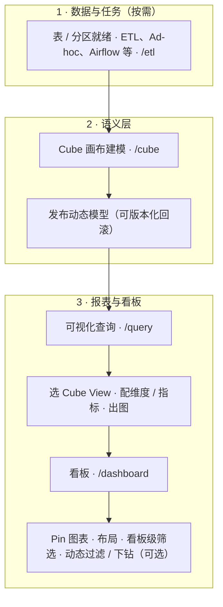
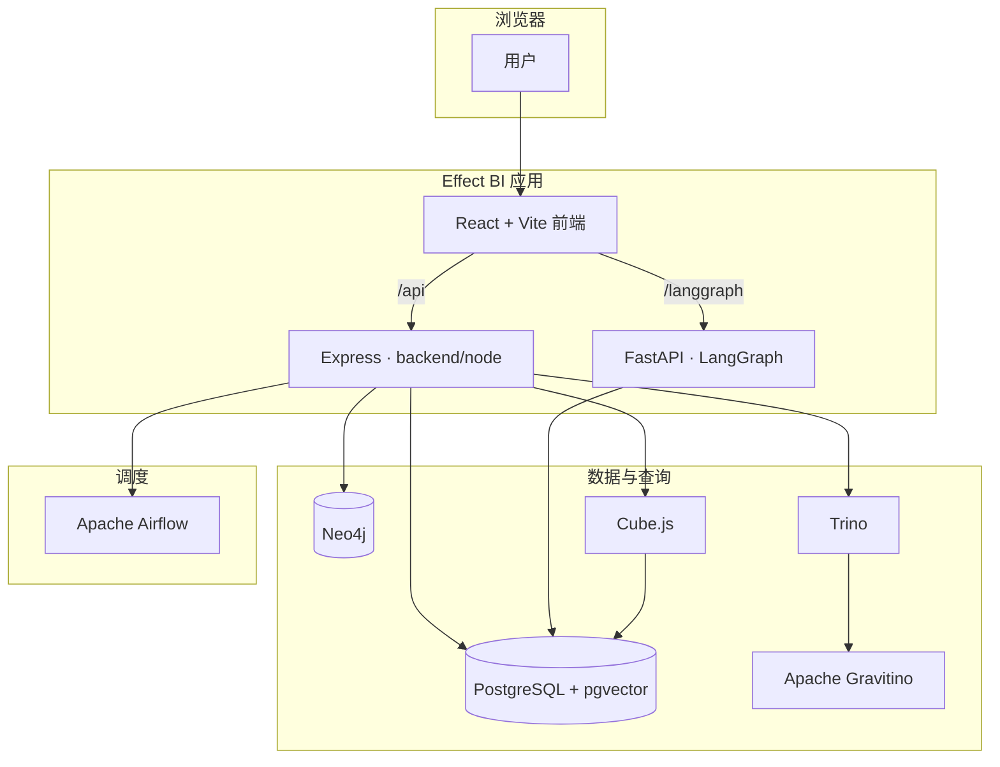

# Effect BI · 数据工作台

面向分析型数据栈的一体化前端：**对话（LangGraph）**、**血缘（Neo4j）**、**Cube 语义层**、**可视化查询与看板**、**ETL / Airflow** 等，由 **React + Vite** 与 `**backend/node`（Express）** 承载主 API；`**backend/langgraph`** 为独立 FastAPI 子模块（Git submodule）。产品与技术说明见 **[docs/README.md](docs/README.md)**。

## 报表开发推荐流程

典型顺序：**数据就绪 → 语义层建模与发布 → 可视化查询出图 → 看板沉淀与筛选**。血缘（`/lineage`）可在建模前后用于理解表依赖；ETL（`/etl`）与调度用于持续产出数据。查询/看板产品细节见 **[docs/README.md](docs/README.md)** 与 `docs/visual-query-and-dashboard-design.md` 等。




## 架构概览

下图概括 **Docker Compose**（`docker-compose.stack.yaml`）下的主要组件与数据流；本地开发时由 Vite 将 `/api`、`/langgraph` 等代理到本机 Node 与 LangGraph，逻辑关系一致。




更细的分层、路由表与开发期代理说明见 **[docs/README.md](docs/README.md)** 第 3 节。

## 主要开源组件

以下为仓库直接依赖或 **Docker Compose** 中引用的代表性开源项目（许可证以各项目官方为准；本仓库自有代码见根目录 [LICENSE](LICENSE)）。

### 基础设施（容器镜像 / 外部服务）


| 项目                                                                                           | 用途                                 |
| -------------------------------------------------------------------------------------------- | ---------------------------------- |
| [PostgreSQL](https://www.postgresql.org/) + [pgvector](https://github.com/pgvector/pgvector) | 业务数据、LangGraph checkpoint、Cube 仓库等 |
| [Neo4j](https://neo4j.com/)                                                                  | 血缘图存储与查询                           |
| [Apache Gravitino](https://gravitino.apache.org/)                                            | 元数据与 Trino 动态目录                    |
| [Trino](https://trino.io/)                                                                   | 分布式 SQL 查询                         |
| [Cube](https://cube.dev/)                                                                    | 语义层与 REST / SQL API                |
| [Apache Airflow](https://airflow.apache.org/)                                                | 工作流调度 |


### 前端（`package.json`）


| 项目                                                                        | 用途                 |
| ------------------------------------------------------------------------- | ------------------ |
| [React](https://react.dev/) / [React Router](https://reactrouter.com/)    | UI 与路由             |
| [Vite](https://vite.dev/) / [TypeScript](https://www.typescriptlang.org/) | 构建与类型              |
| [Tailwind CSS](https://tailwindcss.com/)                                  | 样式                 |
| [Recharts](https://recharts.org/)                                         | 图表                 |
| [React Flow](https://reactflow.dev/)（`@xyflow/react`）                     | 画布与血缘图布局           |
| [Assistant UI](https://www.assistant-ui.com/)                             | 对话界面与 LangGraph 适配 |
| [Monaco Editor](https://microsoft.github.io/monaco-editor/)               | 代码编辑               |


### 主后端 Node（`backend/node`）


| 项目                                | 用途       |
| --------------------------------- | -------- |
| [Express](https://expressjs.com/) | HTTP API |


### AI 后端（`backend/langgraph`，`pyproject.toml`）


| 项目                                                                                                  | 用途               |
| --------------------------------------------------------------------------------------------------- | ---------------- |
| [FastAPI](https://fastapi.tiangolo.com/) / [Uvicorn](https://www.uvicorn.org/)                      | Web 服务           |
| [LangGraph](https://langchain-ai.github.io/langgraph/) / [LangChain](https://python.langchain.com/) | Agent 编排与 LLM 调用 |
| [Langfuse](https://langfuse.com/) / [Prometheus 客户端](https://github.com/prometheus/client_python) 等 | 可观测性（按环境启用）      |


---

## Quick start

### 克隆与子模块

```bash
git clone --recurse-submodules https://github.com/WeiWenda/effect-bi.git
cd effect-bi
# 若已克隆但未拉子模块：
git submodule update --init --recursive
```

### Docker Compose 启动（`docker-compose.stack.yaml`）

```bash
cp docker/stack/env.example docker/stack/.env

bash docker/stack/trino/sync-plugin-from-dev.sh

docker compose --env-file docker/stack/.env -f docker-compose.stack.yaml build
docker compose --env-file docker/stack/.env -f docker-compose.stack.yaml up -d
```

Compose 在解析 YAML 里的 `${VAR:?…}` 时需要这份 env（`service.env_file` 只负责注入容器，不会自动参与变量替换）。若不想写 `--env-file`，也可把同名变量放进仓库根目录的 `.env`，或先在 shell 里 `export`。

默认入口：Web **[http://localhost:3001](http://localhost:3001)**，LangGraph **8001**，Airflow **8080**，Trino **8088**；更多变量与说明见 **docker-compose.stack.yaml** 文件头注释与 **docker/stack/env.example**。

停止：`docker compose --env-file docker/stack/.env -f docker-compose.stack.yaml down`。

### 单独构建镜像（可选）

```bash
docker build --build-arg NODE_IMAGE=docker.m.daocloud.io/library/node:22-bookworm-slim -t effect-bi:local .

docker build -f backend/langgraph/Dockerfile \
  --build-arg PYTHON_IMAGE=docker.m.daocloud.io/library/python:3.13-slim-bookworm \
  --build-arg APT_MIRROR_HOST=mirrors.aliyun.com \
  -t effect-bi-langgraph:latest backend/langgraph
```

---

## Development Guide

### 本地开发（需要提前按需启动gravitino、airflow、cube、neo4j、pg、trino等服务）

```bash
npm install
npm run dev:all
```


| 命令                    | 作用                                                                                              |
| --------------------- | ----------------------------------------------------------------------------------------------- |
| `npm run dev:all`     | 启动 **Vite**（前端）、**Node / Express**（`backend/node`）、**LangGraph / FastAPI**（`backend/langgraph`） |
| `npm run dev:stop`    | 停止上述三个进程                                                                                        |
| `npm run dev:restart` | 重启上述三个进程                                                                                        |
| `npm run dev:status`  | 查看上述进程是否在运行                                                                                     |
| `npm run dev`         | 仅启动 **Vite**（不拉起 Node 与 LangGraph）                                                              |


可选环境变量：`FRONTEND_PORT`（默认 5173）、`BACKEND_PORT`（默认 3001）、`LANGGRAPH_PORT`（默认 8001）；PID 与日志目录为 `.dev-pids/`。

LangGraph 相关配置见 `backend/langgraph/.env.example`。