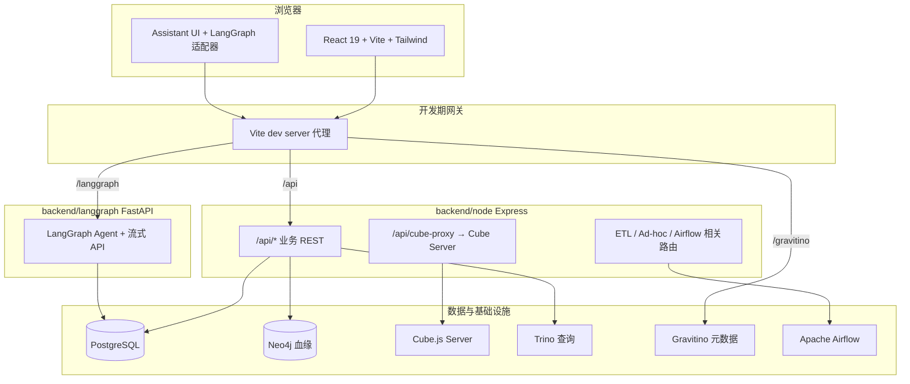

# 项目介绍：数据语义层与一站式数据工作台

本文档面向**对外介绍、立项汇报与新人 onboarding**，概括本仓库的核心价值、创新点与技术架构。更细的设计说明见同目录下各专题文档（如 `visual-query-and-dashboard-design.md`、`dynamic-filter-drilldown-design.md`、`etl_页面技术方案_*.md` 等）。

---

## 1. 项目定位

本项目是一个面向**分析型数据栈**的一体化工作台，将以下能力收敛到同一套前端导航与后端服务中：

- **对话式 AI 助手**：基于 LangGraph 的多轮对话与流式输出，与业务系统账号体系对接。
- **数据血缘**：基于 Neo4j 的实体搜索与上下游血缘图探索。
- **任务与 DAG**：工作流/任务视图（与调度、文件服务等能力衔接）。
- **Cube 语义层**：可视化画布建模，产出可发布的 **Cube.js 动态数据模型**（JSON / YAML / View）。
- **可视化查询与看板**：在语义层之上配置图表并沉淀为看板，强调与开源 BI 产品相近的体验，同时针对**无效查询**与**编辑闭环**做了产品级取舍。
- **ETL 工作台**：多 Tab 的任务开发、Ad-hoc SQL、发布产物与 **Airflow** 集成（DAG 生成、运行依赖、分区就绪检查、质检与告警等方向已有方案与代码骨架）。

目标用户是**数据开发、数据分析师与数据平台工程**，减少在「建模工具 / Cube / BI / 调度 / 血缘」之间的上下文切换。

---

## 2. 核心创新点（相对「拼界面」的差异化）

### 2.1 从画布到 Cube：建模与运行时一体化

- 前端以 **React Flow** 类画布组织表、SQL 节点与字段血缘，支持版本化保存。
- 一键生成符合 **Cube.js Dynamic Data Models** 约定的 `model_json`，并可配合服务端 `asyncModule()` 动态注册（详见 [`cube-dynamic-model-schema.md`](cube-dynamic-model-schema.md)）。
- 子 Cube 命名与版本 id 绑定，避免长成员名与多版本冲突，便于**多次发布与回滚**。

### 2.2 可视化查询 + 看板：体验参考业界，交互上「省查询、可回溯」

- **可视化查询**（`/query`）：左–中–右布局，对标 Superset 类「选 View → 配维度和指标 → 出图」路径；查询走 **Cube REST**（经 Node `cube-proxy` 转发），图表侧使用 **Recharts**。
- **看板**（`/dashboard`）：文件夹与看板级筛选器，交互参考 DataEase；**调整布局时不强制拉真实数据**，降低拖拽布局时的无效 Cube 负载。
- **Pin / 跳回编辑**：在查询页配置好的图表可固定到看板；从看板进入查询页带 `chartId` 等参数，修改后可**覆盖原位置**，形成闭环。

### 2.3 图表上的「动态过滤」与「动态维度下钻」

- **动态过滤器**：与静态过滤区分，在**图表展示区顶部**暴露，允许看数过程中只改「取值」而不回到配置区（设计见 `dynamic-filter-drilldown-design.md`）。
- **动态维度下钻**：在展示区开启后，从字段列表拖入可下钻维度；支持单选/多选、是否允许空选等，增强**同一张图表上的探索性分析**。

### 2.4 ETL：从 IDE 到 Airflow 的可运维闭环（演进中）

- 任务版本、运行实例、分区产出、质检与告警等概念在方案中**与 Neo4j 发布、Trino 执行、Airflow REST** 等打通（参见 `etl_airflow_dependency_quality_alert.plan.md` 与 `etl_页面技术方案_*.md`）。
- Node 侧负责 **DAG 生成路径**（如 `AIRFLOW_HOME/dags`）、**PostgreSQL** 元数据，以及与 Airflow / Trino 的集成；减轻前端直接操作调度系统的复杂度。

### 2.5 统一门户下的多后端形态

- **主业务 API**：`backend/node`（Express + TypeScript），承载血缘、Cube CRUD、图表/看板、ETL、Cube 代理等。
- **AI 对话服务**：`backend/langgraph`（FastAPI + LangGraph + LangChain），以 **Git submodule** 引入，独立演进；前端经 Vite 代理访问 `/langgraph`。
- 开发体验上，`scripts/dev-services.sh` 一键拉起 **Vite + Node + LangGraph**，并处理端口占用提示。

---

## 3. 技术架构

### 3.1 逻辑分层




### 3.2 前端模块与路由（摘要）


| 路由前缀         | 模块    | 说明                                    |
| ------------ | ----- | ------------------------------------- |
| `/chat`      | 对话    | LangGraph API + `@assistant-ui/react` |
| `/lineage`   | 血缘    | Neo4j API，`@xyflow/react` 等           |
| `/dags`      | DAG   | 任务/流程相关视图                             |
| `/cube`      | 语义层   | 画布建模与发布                               |
| `/query`     | 可视化查询 | Cube meta/load + Recharts             |
| `/dashboard` | 看板    | 文件夹、筛选器、网格布局                          |
| `/etl`       | ETL   | 多 Tab：任务开发、Ad-hoc 等                   |


导航入口集中在 `Navbar`；路由定义见 `src/App.tsx`。

### 3.3 后端 Node 路由（摘要）


| 前缀                                 | 职责                                      |
| ---------------------------------- | --------------------------------------- |
| `/api/lineage`                     | 实体搜索、上下游血缘                              |
| `/api/dag`、`/api/task`、`/api/file` | DAG/任务/文件服务                             |
| `/api/cube`                        | Cube 工作区与版本 CRUD                        |
| `/api/chart`、`/api/dashboard`      | 图表与看板持久化                                |
| `/api/cube-proxy`                  | 转发 Cube `/v1/meta`、`/v1/load`、`/v1/sql` |
| `/api/etl`                         | ETL 版本、发布、Ad-hoc 子路由等                   |


实现入口：`backend/node/src/server.ts`。

### 3.4 LangGraph 服务（子模块）

- **框架**：FastAPI、LangGraph、LangChain；**可观测性**：Langfuse、Prometheus 等（以子模块内配置为准）。
- **能力**：JWT 与会话、限流、结构化日志、LLM 重试与多模型注册（见 `backend/langgraph/app/services/llm.py` 等）。
- 前端 `src/services/llmApi.ts` 使用 `**/langgraph/api/v1`**，与 Vite `server.proxy` 对齐，避免误走 Node 的 `/api`。

### 3.5 仓库与协作方式

- **本仓库**：以 **React + Vite** 为主的前端工程，并内嵌 `backend/node`。
- `**backend/langgraph`**：**Git submodule**，远端通常为独立后端仓库；克隆时需 `git clone --recurse-submodules` 或后续 `git submodule update --init --recursive`（见根目录 [`README.md`](../README.md) Quick start）。

---

## 4. 技术栈速览


| 层级          | 主要技术                                                                                                           |
| ----------- | -------------------------------------------------------------------------------------------------------------- |
| 前端          | React 19、TypeScript、Vite 6、Tailwind 4、React Router 7、Recharts、React Flow、react-grid-layout、Monaco、Assistant UI |
| 主后端         | Node.js、Express、PostgreSQL、Neo4j 驱动、Trino 客户端、与 Airflow REST 的集成代码                                             |
| AI 后端       | Python、FastAPI、LangGraph、LangChain、Pydantic、asyncpg/SQLModel（以子模块为准）                                           |
| 语义与查询       | Cube.js（动态模型）、经 Node 代理的 Cube HTTP API                                                                         |
| 元数据与 SQL 探索 | Gravitino（Vite 代理 `/gravitino`）                                                                                |
| 调度          | Apache Airflow（DAG 文件落地与 REST 操作）                                                                              |


---

## 5. 本地开发（极简）

在仓库根目录：

```bash
npm install
npm run dev:all    # 前端 + Node + LangGraph（依赖本机已配置的环境变量与外部服务）
npm run dev:stop   # 停止上述进程
```

端口、代理与子模块说明见根目录 [`README.md`](../README.md) 与 `scripts/dev-services.sh` 头部注释。

**LangGraph `[Errno 48] Address already in use`（默认 8001 被占用）**：先 `npm run dev:stop` 再 `npm run dev:all`；仍占用时 `lsof -nP -iTCP:8001 -sTCP:LISTEN` 后结束对应进程；或 `LANGGRAPH_PORT=8002 npm run dev:all` 并在仓库根 `.env` 设置 `VITE_LANGGRAPH_PROXY_TARGET=http://127.0.0.1:8002`（单独 `npm run dev` 时同理）。

---

## 6. 文档索引


| 文档                                                                      | 内容                           |
| ----------------------------------------------------------------------- | ---------------------------- |
| `visual-query-and-dashboard-design.md`                                  | 查询页与看板整体方案、表结构、API 约定        |
| `dynamic-filter-drilldown-design.md`                                    | 动态过滤与动态下钻                    |
| `etl_页面技术方案_e61fd552.plan.md`                                           | ETL 多 Tab、Ad-hoc、任务开发        |
| `etl_airflow_dependency_quality_alert.plan.md`                          | 依赖检查、质检、告警与表设计演进             |
| `query-page-components-structure.md` / `filter-components-structure.md` | 前端组件拆分参考                     |
| 根目录 [`README.md`](../README.md)                                         | 项目简述、Quick start、Docker 命令 |
| [`cube-dynamic-model-schema.md`](cube-dynamic-model-schema.md)           | Cube 动态模型 JSON 与字段详表        |
| [`archive-llm-product-prompts.md`](archive-llm-product-prompts.md)       | 历史需求 / LLM prompt 存档（非路线图）   |


---

## 7. 小结

本项目把 **「语义层建模 → 即席查询与看板 → 调度与产出治理 → 血缘与助手」** 串成一条连贯链路；创新点集中在 **Cube 动态模型与画布同源**、**BI 交互上的性能与闭环设计**、以及 **ETL 与 Airflow/质检/告警一体化的平台化表达**。技术架构采用 **前后端分离 + 多服务拼盘**，通过 Vite 代理与一键脚本在开发期保持「单入口」体验。