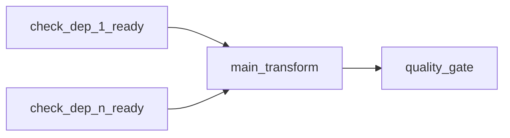

# ETL Airflow：运行依赖检查、任务实例、分区明细、质检与报警 — 技术方案

## 1. 目标与边界

### 1.1 目标

- **DAG 生成**：每条「运行依赖」生成独立 Airflow 任务 `check_<slug>_ready`，以固定间隔调用 Node.js **依赖就绪**接口，直到返回 `true`；多条检查任务汇聚到 **主任务节点**。
- **任务生命周期**：主任务开始前通过 Node 写入 **`task_instances`**；成功/失败再次更新；后端按任务报警配置决定是否产生报警记录（含延时发送）。
- **分区成功明细**：新增 **`table_partition_detail`**，仅在分区执行**成功**时写入/更新；失败不写。
- **报警**：新增报警记录表；支持延时发送；暴露 **报警外部触发**接口供 Airflow 分钟级 DAG 轮询待发送项。
- **质检**：若配置了质检规则，DAG 中 **主任务 → 质检任务**；质检接口内顺序执行 Trino SQL，按规则计算是否全部满足；不满足则将对应 **`table_partition_detail.is_verified`** 置为 `false`，从而影响其它任务在 **check 阶段**的就绪结果。

### 1.2 边界与非目标

- Airflow 侧具体 Operator（`HttpSensor` / `@task` + `requests`）以实现阶段为准；本文约定语义与参数契约。
- IM/短信/电话等真实下发通道可在二期接入；本期预留 channel 字段与调用抽象。
- 与 Neo4j  lineage DAG 的 `task_instances` 查询并存：**同一 PostgreSQL 表扩展用途**，通过区分字段避免语义冲突（见 §4）。

### 1.3 与现有实现对齐

| 模块 | 现状 |
|------|------|
| 运行依赖结构 | `graph_json.runtimeDependencies`，字段见 `EtlRuntimeDependencyRow`（`schema`, `database`, `table`, `partition`, `secondaryPartitions`） |
| DAG 生成 | 发布走 `generateDagPythonWithFallback` → Python `services/etl-dag-service` 或 Node `etlDagGenerator.ts` |
| 质检规则 | `quality_rules_json`：`{ sqlQueries[], rules[] }`，规则为表达式 + 运算符 + 阈值 |
| 报警规则 | `airflow_options_json.alertRules`，见 `EtlAlertRuleRow`（含 `alertTimeWindow` 延时时段） |
| SQL 执行 | `sqlQueryRunner` / Trino |

---

## 2. 业务流程

### 2.1 DAG 拓扑



- **无质检规则**：仅有 `check_*` → `main_transform`（不生成分支质检节点）。
- **有质检规则**：`check_*` → `main_transform` → `quality_gate`（线性，质检在主线任务之后）。

说明：质检校验的是**本任务产出分区**的数据质量；上游就绪由多个 `check_*` 在 **main 之前**完成。

### 2.2 依赖就绪判断（后端）

对单次检查请求，传入上游表的定位信息与分区上下文（见 §5）。就绪条件建议定义为：

1. **`table_partition_detail`** 中存在对应记录：**同一** `catalog/schema.database.table`（或项目约定的三元组）、**解析后的主分区**、**解析后的二级分区集合**一致；
2. 且 **`is_verified = true`**（若历史上曾质检失败被置 `false`，则就绪为否，直至该分区被重新跑成功且质检通过或过治理重置——策略见 §6.3）。

不存在记录 → 未就绪；仅成功写入明细表，失败不写 → 天然「未就绪直到成功」。

### 2.3 分区表达式与「昨日」

- UI 与 JSON 中 `partition` 可为字面量或相对表达式（如 `-1 day`）。
- **解析基准**：Airflow 传入 **`logical_date` / `data_interval_end`**（ISO 8601），Node 将表达式解析为**具体分区键值**（如 `dt=2026-05-03` 中的日期部分或自定义单列值）。
- **二级分区**：多值 **英文逗号分隔**；就绪匹配时需与明细表中存储格式一致（建议规范化排序后存储或比较）。

实现阶段应收敛表达式语法（建议：仅支持 `-N day` / 固定字面量 / ISO 日期），并在文档与接口中报错返回可读信息。

---

## 3. 数据库设计

### 3.1 `table_partition_detail`（新建）

记录「某表某分区已成功产出」及质检状态。

| 列 | 类型 | 说明 |
|----|------|------|
| `id` | BIGSERIAL PK | |
| `catalog_name` | VARCHAR | 与 Gravitino/Trino 一致；若前端仅有 schema/database/table，可映射填入 |
| `schema_name` | VARCHAR | |
| `database_name` | VARCHAR | 与现有运行依赖 `database` 对齐 |
| `table_name` | VARCHAR | |
| `primary_partition_key` | VARCHAR | 规范化后的主分区标识（如日期字符串） |
| `secondary_partition_key` | VARCHAR NULL | 规范化后的二级分区；无则 NULL |
| `etl_task_version_id` | INT FK → `etl_task_versions(id)` NULL | 写入方任务版本（产出方） |
| `partition_date` | DATE | 业务日（便于与现有 `task_instances.partition_date` 对齐查询） |
| `is_verified` | BOOLEAN NOT NULL DEFAULT true | 质检未跑或为遗留成功可为 true；质检失败置 false |
| `last_success_at` | TIMESTAMPTZ | 最后一次标记成功的时间 |
| `created_at` / `updated_at` | TIMESTAMPTZ | |

**唯一约束**：建议 `(catalog_name, schema_name, database_name, table_name, primary_partition_key, secondary_partition_key)` 或使用生成的 `partition_signature` 哈希列避免宽唯一索引过长。

**索引**：按表名 + 分区键查询就绪；按 `is_verified`。

### 3.2 报警记录表（新建，示例名 `etl_alert_dispatch`）

| 列 | 类型 | 说明 |
|----|------|------|
| `id` | BIGSERIAL PK | |
| `source` | VARCHAR | 如 `task_failure`, `success_late`, `cumulative_threshold`, `manual` |
| `etl_task_version_id` | INT FK NULL | |
| `task_instance_id` | INT FK → `task_instances(id)` NULL | 关联一次运行 |
| `reason` | TEXT | 人类可读原因 |
| `payload_json` | JSONB | 策略快照、收件人等 |
| `channel` | VARCHAR | 与前端 `alertRules.channel` 对齐 |
| `scheduled_send_at` | TIMESTAMPTZ NULL | 未到时段则为计划发送时间 |
| `sent_at` | TIMESTAMPTZ NULL | 已发送时间 |
| `send_status` | VARCHAR | `pending` / `sent` / `skipped` / `failed` |
| `created_at` | TIMESTAMPTZ | |

索引：`(send_status, scheduled_send_at)` 供分钟任务扫描 `pending`。

### 3.3 `task_instances`（扩展，兼容 lineage）

现有表服务于 Neo4j Hive 任务文件维度（`task_file`, `partition_date`, `attempt`）。ETL Airflow 写入时建议 **增量迁移**：

| 新增列 | 类型 | 说明 |
|--------|------|------|
| `instance_kind` | VARCHAR NOT NULL DEFAULT `'lineage'` | `'lineage'` \| `'etl_airflow'` |
| `etl_task_version_id` | INT NULL FK | 发布版本 |
| `airflow_dag_id` | VARCHAR NULL | |
| `airflow_run_id` | VARCHAR NULL | |
| `airflow_task_id` | VARCHAR NULL | 主任务 task_id |
| `try_number` | INT NULL | 与 Airflow try 对齐 |
| `logical_partition_label` | VARCHAR NULL | 解析后的分区标签快照 |

**ETL 写入约定**：`task_file` 可固定模式 `etl:<logical_task_name>:v<version_id>:main`，以便兼容唯一约束 `(task_file, partition_date, attempt)`；或使用迁移放宽唯一约束为「ETL 用 `(instance_kind, airflow_run_id, airflow_task_id, try_number)` 唯一」。实现时在迁移脚本中二选一并写明。

现有 `/api/task/dag/:dagId` 查询应对 `instance_kind = 'lineage'` 过滤，避免 ETL 记录混入 lineage 视图（或前端分区展示）。

---

## 4. HTTP API 契约（Node.js）

统一前缀以现有后端为准（如 `/api/etl/...`）。以下均为 JSON。

### 4.1 依赖就绪检查（供 Airflow check 节点轮询）

- **方法** `POST /api/etl/runtime-deps/check-ready`
- **Body**：
  - `schema`, `database`, `table`（必填）
  - `catalog`（可选，缺省走配置默认）
  - `partition`（必填，原始字符串，如 `-1 day`）
  - `secondaryPartitions`（可选，逗号分隔）
  - `logicalDate`（必填，ISO，用于解析 `-1 day`）
- **Response**：`{ "ready": boolean }`

轮询间隔 **10s** 在 Airflow 任务属性中配置（如 `poke_interval=10`）；就绪返回 `true` 后任务成功。

### 4.2 注册任务开始（主任务首个回调）

- **POST** `/api/etl/task-runs/start`
- **Body**：`etlTaskVersionId`, `partitionDate`, `airflowDagId`, `airflowRunId`, `airflowTaskId`, `tryNumber`, `logicalPartitionLabel`, `startedAt`
- **Response**：`{ "taskInstanceId": number }`

写入 `task_instances`，`status = 'running'`。

### 4.3 任务结束（成功/失败）

- **PATCH** `/api/etl/task-runs/:id/complete`
- **Body**：`status`: `success` | `failed`, `endedAt`, 可选 `errorMessage`

根据 **`airflow_options_json.alertRules`** 与策略计算是否 **插入** `etl_alert_dispatch`（延时则填 `scheduled_send_at`）。  
若 **成功**：写入/更新 **`table_partition_detail`**（`is_verified` 先置 `true` 或待定——若质检在后，见 §6.1）。

### 4.4 质检执行（quality 节点单次调用）

- **POST** `/api/etl/quality/execute`
- **Body**：`etlTaskVersionId`, `logicalDate`, 及解析后的分区键（或与 start run 关联的 `taskInstanceId`）
- **行为**：加载该版本 `quality_rules_json`，对每条 `sqlQueries[i]` 跑 Trino，将结果交给 `rules[i]` 表达式求值；**全部满足**则将该产出分区 `table_partition_detail.is_verified = true`；**任一不满足**则 `is_verified = false`。
- **Response**：`{ "passed": boolean, "details": [...] }`

### 4.5 报警：外部触发（供 Airflow 分钟 DAG）

- **POST** `/api/etl/alerts/dispatch-tick`
- **Auth**：共享密钥 `Authorization: Bearer <ETL_ALERT_DISPATCH_SECRET>` 或仅内网
- **行为**：查找 `send_status = 'pending'` 且 `scheduled_send_at <= now()` 的记录，尝试发送，更新 `sent_at` / `send_status`。

可选：**GET** `/api/etl/alerts/pending-count` 供监控。

---

## 5. 与 DAG 生成器的衔接

- **输入**：从 `graph_json.runtimeDependencies` 数组展开多条 check；从 `quality_rules_json` 判断是否追加 `quality_gate`。
- **嵌入常量**：`BACKEND_BASE_URL`、`ETL_TASK_VERSION_ID`、`DAG_ID`、鉴权 token（若需要）应写入生成 Python 或通过 Airflow Variable/Connection 引用，**禁止**把数据库密码写入 DAG。
- **修改点**：
  - `services/etl-dag-service/app/main.py` 中 `_render_dag_py`：生成真实 `check_*` 与边。
  - `backend/src/services/etlDagGenerator.ts`：fallback 同步逻辑，避免仅 Python 服务可用时的不一致。

### 5.1 Check 任务实现要点

- 使用 **`HttpSensor`**（`poke_interval=10`, `mode='poke'`）或 `@task` 内循环调用 HTTP，直至 `ready`。
- URL 指向 Node 服务（与 Airflow Worker 网络互通）。

---

## 6. 关键业务规则澄清

### 6.1 成功写 `table_partition_detail` 的时机

两种兼容策略（实现前择一写入方案文档最终版）：

- **A**：主任务成功立即写一条 `is_verified = true`，质检失败再改为 `false`（下游短暂可能看到「就绪」——若不希望，选 B）。
- **B**：主任务成功写 `is_verified = false` 或不写明细；仅质检通过后写成功且 `is_verified = true`。

推荐 **B** 或 **A + 就绪条件必须 verified**：与「质检失败影响 check」一致。

### 6.2 主任务成功但未配置质检

直接写入 `table_partition_detail`，`is_verified = true`（无质检即视为通过）。

### 6.3 `is_verified = false` 后的修复路径

- 人工或运维接口将某分区明细重置/删除，或重跑主任务+质检。

---

## 7. 实现阶段划分（建议）

| 阶段 | 内容 |
|------|------|
| **P1** | 迁移：`table_partition_detail`、`etl_alert_dispatch`、`task_instances` 扩展 |
| **P2** | API：`check-ready` + 分区解析工具单元测试；`task-runs/start|complete` |
| **P3** | 报警评估逻辑 + `dispatch-tick`；与 `alertRules` 对齐 |
| **P4** | `quality/execute` + Trino + 表达式求值（隔离沙箱见实现选型） |
| **P5** | DAG 生成：多 check + main + 可选 quality；环境变量与文档 |
| **P6** | 回归： lineage `task_instances` 查询过滤 `instance_kind`；前端可选展示 ETL 运行列表（非必须） |

---

## 8. 风险与依赖

- **Airflow → Node 网络**：Worker 必须能访问后端基地址。
- **表达式安全**：质检规则中的 `expression` 若为 JS eval，需限制上下文或改为预定义聚合函数。
- **时钟**：`logicalDate`、延时报警、`success_later_than_time` 依赖服务器时区约定（建议统一 UTC 存储 + 业务时区配置）。

---

## 9. 附录：运行依赖 JSON 示例

```json
{
  "runtimeDependencies": [
    {
      "schema": "demo",
      "database": "hive",
      "table": "upstream_sales",
      "partition": "-1 day",
      "secondaryPartitions": "cn,us"
    }
  ]
}
```

生成 DAG 时将为该条生成 `check_dep_<i>_ready`（按数组下标）。

---

## 10. 实现落地说明（续）

### 10.1 `graph_json` 扩展字段

- **`outputTable`**（对象）：`catalog?`、`schema`、`database`、`table`。任务成功写入 `etl_table_partition_detail`、质检更新校验状态时必填（后端 `parseOutputTable`）。
- **`outputPartition`**（对象）：`expr`（默认 `-1 day`）、`secondaryPartitions`（可选，逗号分隔）。Python 生成 DAG 与 `main_transform` / `quality_gate` 用其解析主分区键；须与任务产出分区语义一致。

### 10.2 环境变量（后端 / Airflow）

| 变量 | 用途 |
|------|------|
| `DEFAULT_ETL_CATALOG` | `check-ready` 缺省 catalog（默认 `hive`） |
| `ETL_ALERT_DISPATCH_SECRET` | `POST /api/etl/alerts/dispatch-tick` 的 Bearer 密钥 |
| `ETL_BACKEND_URL` | Airflow DAG 内 HTTP 基址（Python 生成代码读取） |

### 10.3 数据库表名

- 分区明细表：**`etl_table_partition_detail`**
- 报警队列表：**`etl_alert_dispatch`**
