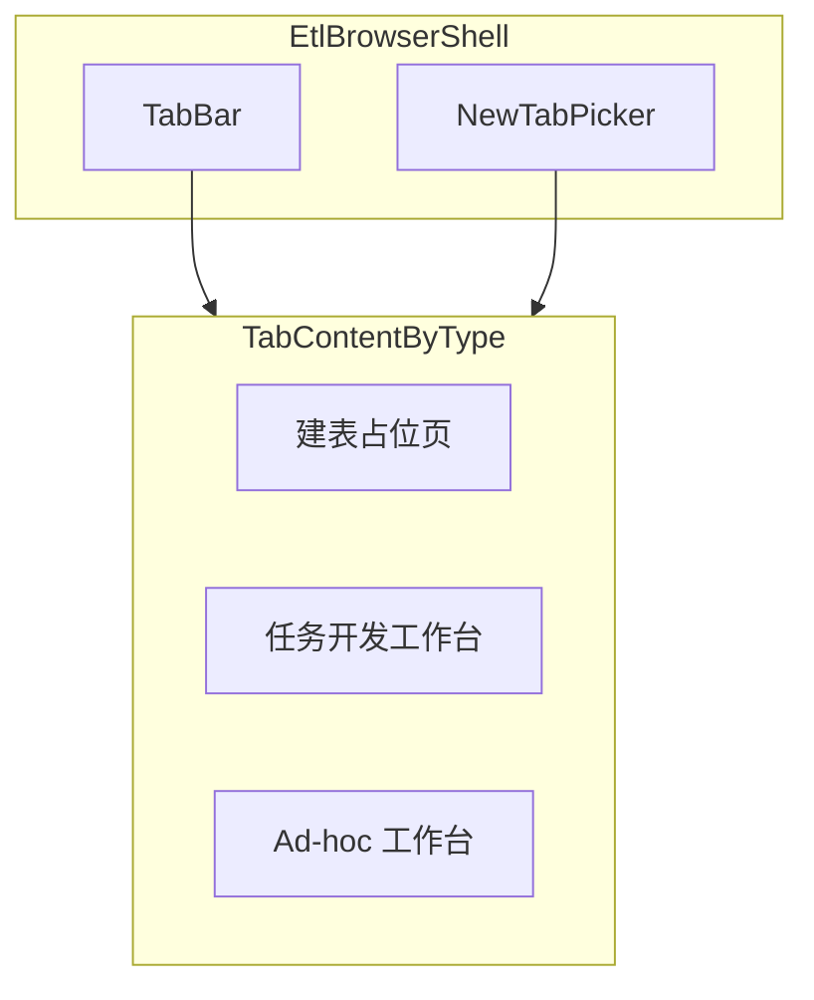

# ETL 页面技术方案

## 1. 目标与范围

- **目标**：设计「类浏览器多 Tab」的 ETL 工作台；新建 Tab 时选择 **建表（占位）** / **任务开发** / **Ad-hoc** 之一。
- **本次范围**：仅技术方案与模块边界；**不**实现多用户查询审计后端（表结构预留即可）。
- **对齐现有工程**：
  - 路由已有 `[src/components/ETL.tsx](src/components/ETL.tsx)` + `[src/App.tsx](src/App.tsx)` 中 `path="etl"`。
  - Cube 发布写盘模式可参考 `[backend/src/routes/cube.ts](backend/src/routes/cube.ts)`（`CUBE_HOME` + `fs.writeFileSync` + 事务内 DB 状态与文件一致性策略）。
  - 元数据树与列详情：`[src/components/cube-explore/MetadataTreePanel.tsx](src/components/cube-explore/MetadataTreePanel.tsx)` + `[src/services/gravitinoApi.ts](src/services/gravitinoApi.ts)` 中 `getTableDetail`（`ColumnInfo` 含 `name`、`type`、`nullable`）。
  - SQL 编辑器：项目已用 `@monaco-editor/react`（如 `[src/components/dag-explore/DagDetailPage.tsx](src/components/dag-explore/DagDetailPage.tsx)`）。

---

## 2. 整体信息架构

- **壳层职责**：Tab 列表（标题、关闭、可选固定「首页」Tab）、**新建 Tab** 打开类型选择（Modal 或内联向导）、当前 Tab 内容区、可选「未保存」提示与关闭确认。
- **状态模型（前端）**：`EtlTab[]`，每项至少包含：`id`（uuid）、`kind: 'ddl-placeholder' | 'task-dev' | 'adhoc'`、`title`、`payload`（各类型私有状态快照）、`createdAt`。可选：`serverResourceId`（任务草稿 id、Ad-hoc session id）用于刷新后恢复。
- **URL 策略（建议）**：首版可 **纯内存 Tab**；二期用 `?tab=<uuid>` 或 `/etl/adhoc/:sessionId` 做深链。与现有 `/cube/:name` 风格一致即可。

---

## 3. 功能一：建表（暂不实现）

- **UI**：新建 Tab 选「建表」后，内容区展示静态说明 +「即将上线」；不挂载路由子树逻辑。
- **预留**：将来若与 Gravitino/HMS 建表联动，可与 Ad-hoc 左侧树共用「catalog/schema/table」上下文。

---

## 4. 功能二：任务开发（Airflow DAG 为终态）

### 4.1 产品能力拆分

| 能力         | 说明                                                                                                                                    |
| ---------- | ------------------------------------------------------------------------------------------------------------------------------------- |
| 可视化 SQL 编写 | Monaco + 语法高亮；可选方言配置（SparkSQL/Trino/Hive 等与执行引擎一致）。                                                                                   |
| 试运行        | 在**受控连接**上执行（超时、行数上限、只读账号）；与正式调度分离。                                                                                                   |
| 运行依赖管理     | DAG 内 `task_id` 级依赖 + 可选「外部 DAG 传感器」配置；前端可用简化图（列表 + 拓扑）或轻量图编辑。                                                                        |
| 运行监控配置     | Airflow 侧：`retries`、`retry_delay`、`email_on_failure`、 SLA 等 → 映射为表单/JSON。                                                             |
| 质量监控配置     | 抽象为「规则列表」：如行数阈值、空值率、自定义 SQL check；生成 `PythonOperator`/`SQLCheckOperator` 或统一 `ShortCircuit` 模板。                                       |
| 发布         | 与 Cube 类似：**后端**根据版本生成 **单个 DAG 文件**（或 DAG 包目录），写入 `**AIRFLOW_HOME/dags`**（环境变量命名建议 `AIRFLOW_HOME` 或 `ETL_AIRFLOW_DAGS_DIR`，与运维约定一致）。 |

### 4.2 后端域模型（建议）

- `**etl_task_definitions`（或 `etl_dag_versions`）**：`id`、`name`（逻辑任务名）、`remark`、`canvas_or_graph_json`（依赖与节点布局）、`sql_by_task`（map）、`airflow_options_json`（监控/调度参数）、`quality_rules_json`、`dag_python_content` 或 **仅存模型由服务生成**（推荐存结构化 JSON，发布时渲染模板，便于 diff）。
- `**is_published`**：同 cube 语义，同逻辑名仅一个已发布版本（可复用「唯一部分索引」模式，见 `[backend/migrations/create_cube_versions.sql](backend/migrations/create_cube_versions.sql)` 思路）。
- **发布事务**：DB 提交「当前发布版本」与 **写文件** 要么同事务后顺序执行并在失败时回滚 DB 或补偿删除文件（与 `cube.ts` 中 `BEGIN` + 写 `CUBE_HOME` 的模式对齐，并文档化「文件写失败」行为）。

### 4.3 DAG 生成策略

- **模板化**：服务端用固定 Jinja2/EJS 式模板或 TS 字符串模板生成 `dag_id = f"etl_{safe_name}_{versionId}"`，避免用户直接写任意 Python（降低注入风险）。
- **试运行**：不走 Airflow；走后端 **Query Runner** 服务（与 Ad-hoc 共用执行层，见下）。
- **与现有 DAG 列表页关系**：当前 `[Dags.tsx](src/components/Dags.tsx)` / `[dagApi](src/services/dagApi.ts)` 偏「血缘视图」；若 Airflow 调度 DAG 与现表无关联，需在方案中明确 **两套概念**：「血缘 DAG 视图」vs「ETL 发布到 Airflow 的 DAG」，避免命名冲突（例如 ETL 产物前缀 `etl_`）。

### 4.4 前端模块划分（建议路径）

- `EtlTaskDevTab.tsx`：主布局（SQL 区、依赖区、配置表单、发布按钮）。
- `etlTaskApi.ts`：CRUD 版本、试运行、发布 API。
- 依赖图：可复用 `@xyflow/react`（与 DagDetailPage 一致）或先做列表+Mermaid 降级。

---

## 5. 功能三：Ad-hoc（调试 SQL）

### 5.1 布局

- **左**：与 Cube 左侧类似的 **Catalog → Schema → Table** 懒加载树；**差异**：Table 节点可展开 **Column** 子节点（数据来自 `gravitinoAPI.getTableDetail`；`type` 展示为 `catalogString` 或序列化后的 JSON）。
- **右上**：SQL 编辑器（Monaco），支持从树拖拽/点击插入「三段式表名」占位（产品细节）。
- **右下**：**提交区** + **结果区**。
  - **结果区**：**左** 历史提交列表（时间、状态、摘要）；**右** 当前选中提交的 **结果表格**（列动态、分页、行数上限）。
  - **交互**：点击某条历史 → **编辑器回显该次 `sql_text`**，右侧表格切换到该次 **已持久化结果**（若仅存摘要则按需懒加载完整结果）。

### 5.2「多 Session」语义

- **每个 Ad-hoc Tab** 对应一个 `**adhoc_session`**（PG 一行）：`id`、`title`（可默认「Ad-hoc · 时间」）、`user_id`（预留）、`engine`/`catalog` 默认上下文（可选 JSON）。
- **每次提交** 对应 `**adhoc_submission`**：`id`、`session_id`、`sql_text`、`status`（queued/running/success/failed/cancelled）、`error_message`、`submitted_at`、`finished_at`、`result_schema_json`、`result_preview_json` 或 **对象存储引用**（大结果集时）。
- **前端状态**：`activeSubmissionId`；列表按 `submitted_at DESC`；编辑器内容与「当前草稿」可 debounce 自动保存到 `session.draft_sql`（可选列），避免刷新丢失。

### 5.3 API 草图（后端）

- `POST /api/etl/adhoc/sessions` → 创建 session（打开新 Ad-hoc Tab 时）。
- `GET /api/etl/adhoc/sessions/:id` → session + 最近 N 条 submission 摘要。
- `GET /api/etl/adhoc/sessions/:id/submissions` → 分页列表。
- `POST /api/etl/adhoc/sessions/:id/submit` → body: `{ sql }` → 异步执行时返回 `submissionId` + `202` 或轮询 `GET .../submissions/:sid`。
- `GET /api/etl/adhoc/submissions/:id/result` → 表格数据（分页 cursor/limit）。

**执行引擎**：方案中定义 **Runner 接口**（`execute(sql, limits) -> { columns, rows, stats }`），首版可 Mock 或接已有数仓；与任务开发「试运行」共用。

### 5.4 与现有组件关系

- 左侧树：**抽取**或 fork `MetadataTreePanel` 的加载逻辑为 `GravitinoMetadataTree`（支持 `maxDepth: 'column'`），避免与 Cube 画布强耦合。
- 不强制复用 `FieldListPanel`（其为度量/维度语义）。

---

## 6. 横切能力

- **鉴权**：与现 ProtectedRoute 一致；表结构预留 `user_id` / `tenant_id`，查询历史接口预留 `WHERE user_id = $current`。
- **安全**：Ad-hoc/试运行 **统一** 超时、最大行数、禁止多语句（可配置）、只读数据源。
- **观测**：submission 表记录 `duration_ms`、`rows_returned`；为将来「监测后端」留导出或只读副本接口。
- **配置**：新增 `AIRFLOW_HOME`（或专用 `ETL_DAGS_DIR`）、查询引擎 JDBC/REST 等 **仅后端** 环境变量，不入前端。

---

## 7. 实施阶段建议（供后续开发排期）

1. **壳层 + Tab 类型路由**：`ETL.tsx` 升级为 `EtlWorkspace` + 新建 Tab 选择器 + 三种占位/骨架。
2. **Ad-hoc**：PG 表 + API + 左树（含列）+ 右下历史/结果 + 提交链路（可先 Mock Runner）。
3. **任务开发**：版本表 + 表单/JSON 配置 + DAG 模板生成 + 写 `AIRFLOW_HOME/dags` + 发布按钮。
4. **建表**：替换占位页。
5. **深链、草稿自动保存、大结果集外置存储**。

---

## 8. 风险与决策点（需在开发前拍板）

- **Airflow 版本与 DAG 形态**：Python DAG vs YAML/Task SDK；影响模板与可配置项，用Task SDK方式吧，这需要另外启动一个python backend，用fastapi提供接口给前端吧。
- **查询引擎**：Ad-hoc/试运行共用哪条链路（Trino/Spark Connect/JDBC），用Trino。
- **ETL 产物与现有 `dag_views` 表**：是否引入新表 `etl_airflow_deployments` 避免与血缘 DAG 混用，引入新表，ETL产物是ariflow的dag，其节点是用来做数据依赖检测和数据质量监控用的，和dag_views的表依赖是两码事。

以上方案与现有 [cube 发布写盘](backend/src/routes/cube.ts)、[Gravitino 树 + getTableDetail](src/services/gravitinoApi.ts)、[Monaco 使用](src/components/dag-explore/DagDetailPage.tsx) 对齐，便于分阶段落地。