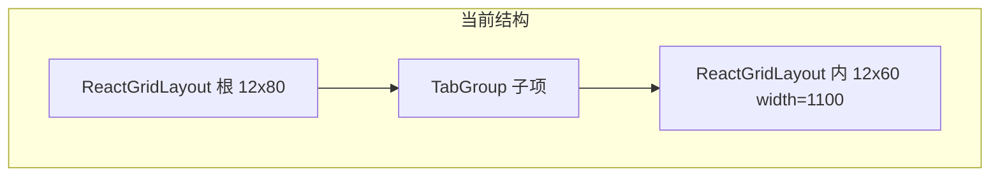

# 看板标签组嵌套布局改造计划

## 问题定位（与代码对应）

| 现象 | 原因 |
|------|------|
| 子网格拖拽带动父网格 | 根级与 [`TabGroupContainer`](src/components/dashboard-explore/TabGroupContainer.tsx) 内各有一个 `ReactGridLayout`，鼠标/触摸目标在嵌套场景下易触发错误一层；内层未使用独立 `draggableHandle` 或严格事件隔离。 |
| 内层 `compact` 与父级互相干扰 | 两层都走 `onLayoutChange` 与 RGL 内部 compact，父级在 [`DashboardDetailPage`](src/components/dashboard-explore/DashboardDetailPage.tsx) 的 `handleLayoutChange` 中整表替换 `layout`；子级在 `handleInnerLayoutChange` 中更新 `tabGroupTabs[].innerLayout` — 虽非同一 state，但布局重算、高度同步会连锁重渲染。 |
| 高度与根下图表位置不一致 | 父级用 `tabGroupHeights` 把**像素高度**换为 `h = ceil(px / ROW_HEIGHT)`（`ROW_HEIGHT=80`），而子级用 `INNER_ROW_HEIGHT=60` 与 **固定 `width={1100}`**；与根级 `width={1200}`、子级真实容器宽度均不一致，导致「行高」语义分裂。见父级 559–564 行与 `TabGroupContainer` 166–201、284–290 行。 |

## 方案对比

**A. 仅修嵌套 RGL（小改，风险仍存）**  
- 内层：改 `width` 为 `ResizeObserver` 量到的容器宽；`compactType` 设 `null` 或 `vertical` 与父级显式约定；**仅**通过专用 handle 拖拽（如内层增加 class 与 `draggableHandle` / 库支持写法以 v2 API 为准）。  
- 父级：对 `TabGroup` 子项在拖拽子区时 `pointer-events` 或 capture 阶段隔离（需与库行为验证）。  
- 缺点：RGL 对嵌套支持差是社区共识，易反复踩坑。

**B. 推荐：一层 RGL + 标签组内 CSS Grid（中改，数据可复用）**  
- **根看板**继续用现有 [`DashboardDetailPage`](src/components/dashboard-explore/DashboardDetailPage.tsx) 的**单层** `ReactGridLayout`（或后续再换行式，见 C）。  
- **标签组内部**删除 [`TabGroupContainer`](src/components/dashboard-explore/TabGroupContainer.tsx) 中的 `ReactGridLayout`，改为：  
  - 使用 `display: grid; grid-template-columns: repeat(12, minmax(0, 1fr))`；  
  - 将已有 [`InnerChartLayout`](src/types/chart.ts)（x,y,w,h）映射为 `gridColumn: ${x + 1} / span ${w}`、`gridRow: ${y + 1} / span ${h}`；  
  - 需要「编辑内布局」时：用 **react-resizable**（仅 resize）+ **@dnd-kit**（可选，用于区块拖拽/换位）替代整格 RGL，避免第二层网格引擎。  
- **高度**：标签组网格区高度由 `max(y+h)` × 行高（单一代码路径）计算，父级仍可用动态 `h` 或改为 `auto` 行高策略（见下）。  
- 优点：`innerLayout` 可保留，不必立刻改 DB；彻底去掉嵌套 RGL 是消除冲突的关键。

**C. 长期：Superset 式行/列树（大改，与「放弃 RGL」一致）**  
- 新模型例如：`rows: Array<{ id; cells: Array<{ span: 1..12; kind; ref }> }>`，标签组作为某种 `kind` 的 cell，其内部再嵌套 `rows` 或 `cells`（与 Superset 的 row → column → chart 同类）。  
- 在 [`backend` dashboard JSON](backend/src/routes/dashboard.ts) 中 `layout` 字段可版本化（如 `version: 2`）或加载时检测结构并迁移。  
- 编辑交互：行内列宽拖拽、行间排序用 dnd-kit；无全局 x/y compact。  
- 需提供从当前 `DashboardLayoutItem[]` 到行模型的**迁移函数**（按 y、x 排序分组为行，再写入 span；边界情况需在实现时写清测试）。

## 建议落地顺序

1. **先做 B**：改动集中 [`TabGroupContainer.tsx`](src/components/dashboard-explore/TabGroupContainer.tsx) + 少量父级高度同步逻辑；确认编辑/预览下内区图表与根级图表不再「抢拖拽」。  
2. 内区若需 resize：为每个图表 card 加 `react-resizable` 的东/南角，**写回** `innerLayout` 的 w/h（x,y 可固定为当前格或配合简单「换行」规则）。  
3. 父级 `tabGroupHeights`：与内区统一**单一**行高常数，或内区用 `min-height` + 父级用 `h` 仅表示「最小行数」并允许内容溢出策略（二选一，在实现时定一条规则避免再双计）。  
4. 若产品要求全看板与 Superset 一致：在 B 稳定后再做 C，并做 layout 迁移与回归用例（含：仅图表、仅标签组、混合、多 tab、innerLayout 边界）。

## 关键文件

- [`src/components/dashboard-explore/DashboardDetailPage.tsx`](src/components/dashboard-explore/DashboardDetailPage.tsx) — 根布局、`tabGroupHeights` 与 RGL 配置。  
- [`src/components/dashboard-explore/TabGroupContainer.tsx`](src/components/dashboard-explore/TabGroupContainer.tsx) — 去掉内层 RGL，改为 CSS Grid +（可选）resize/dnd。  
- [`src/types/chart.ts`](src/types/chart.ts) — 若引入布局版本或行模型，扩展类型与向后兼容。  
- [`docs/visual-query-and-dashboard-design.md`](docs/visual-query-and-dashboard-design.md) / [`docs/tab-group-container-design.md`](docs/tab-group-container-design.md) — 事后与实现同步文档（仅在你方要求更新文档时）。

## 验收要点

- 编辑模式下：仅在标题栏/专用手柄拖动标签组整体；在内区拖动/缩放**绝不**带动根网格项错位。  
- 切换 tab、增删内图后，标签组外框高度与根网格占位一致、无大块留白或裁切。  
- 保存后再加载，`innerLayout` 与根级 `layout` 与当前行为兼容。
